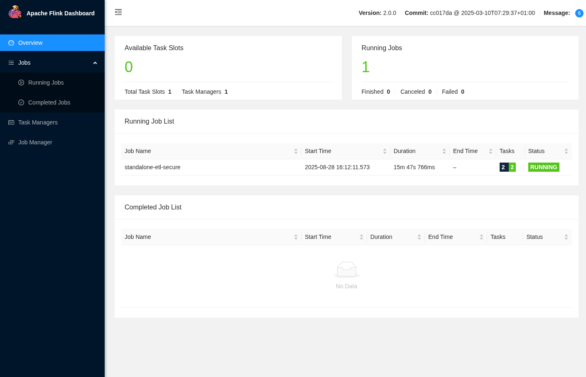
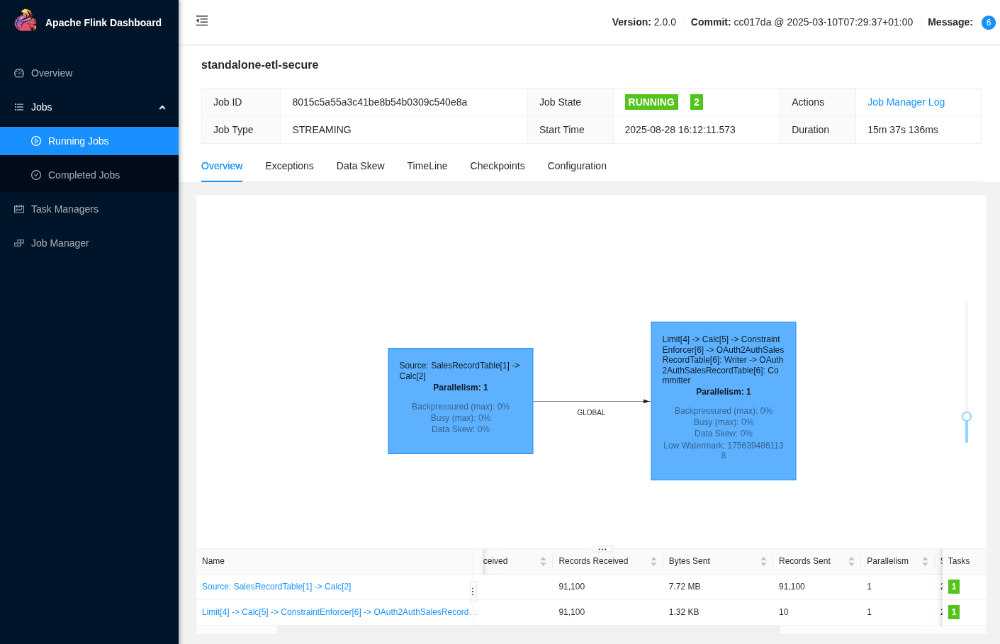

+++
title = 'Connecting to Kafka securely using Flink SQL'
+++

> Note: This tutorial is mainly focused on securing connections between Flink SQL and Kafka.
> For detailed information on working with [Flink ETL Jobs](https://nightlies.apache.org/flink/flink-docs-release-2.1/docs/learn-flink/etl/)
> and [Session Clusters](https://nightlies.apache.org/flink/flink-kubernetes-operator-docs-main/docs/custom-resource/overview/#session-cluster-deployments),
> look at the [Interactive ETL example](../interactive-etl/_index.md).

[Flink SQL](https://nightlies.apache.org/flink/flink-docs-release-2.1/docs/dev/table/overview/) is a powerful tool for data exploration, manipulation and inter-connection.
It allows you to access the power of Flink's distributed stream processing abilities with a familiar interface.
In this tutorial, we go over ways to securely connect to Kafka from Flink SQL.

In the sections below, we cover all the supported secure connection options for Kafka.
In each case, we go over how to configure the data generator script
so that it sets up an example Kafka cluster with the appropriate secure listener,
and then we show the configuration needed to connect to that secure listener in Flink SQL.

The tutorial is based on the StreamsHub [Flink SQL Examples](https://github.com/streamshub/flink-sql-examples) repository and the code can be found under the [`tutorials/secure-kafka`](https://github.com/streamshub/flink-sql-examples/tree/main/tutorials/secure-kafka) directory.

> Note:
> - This tutorial only covers authentication, not authorization. 
> - All the commands below are meant to be run from the `tutorials` directory.
> - The Flink SQL commands assume the query is being run on our Flink distribution.
>   - `quay.io/streamshub/flink-sql-runner`
>     - Includes [Strimzi's OAuth 2.0 callback handler](https://github.com/strimzi/strimzi-kafka-oauth).
>     - Shades Flink Kafka dependencies.
>       - This is done to prevent dependency conflicts.
> - Only relevant lines are included in the code blocks.
>   - The `tutorials/secure-kafka` directory contains the complete files.
> - For greater detail on what is covered in this tutorial, you can read the following:
>   - [“Security” section in the Apache Kafka SQL Connector documentation](https://nightlies.apache.org/flink/flink-docs-release-2.1/docs/connectors/table/kafka/#security)
>   - ["Securing access to a Kafka cluster" in the Strimzi documentation](https://strimzi.io/docs/operators/latest/deploying#assembly-securing-access-str)
>   - [“Security” section in the Apache Kafka documentation](https://kafka.apache.org/documentation/#security)

## Unsecure

### PLAINTEXT

- No encryption.
- No authentication.

Set up the demo application:

```shell
# Note: PLAINTEXT is the default option if you don't pass SECURE_KAFKA.
# Note: This sets up Kafka, Flink, recommendation-app (generates example data), etc.
SECURE_KAFKA=PLAINTEXT ./scripts/data-gen-setup.sh

# This creates a standalone Flink job
kubectl -n flink apply -f recommendation-app/flink-deployment.yaml
```

The commands above apply the following:

```yaml
apiVersion: kafka.strimzi.io/v1beta2
kind: Kafka
metadata:
  name: my-cluster
spec:
  kafka:
    listeners:
      - name: plain
        port: 9092
        type: internal
        tls: false      # Plain listener with no encryption
```

We can connect to the plain listener, like in the other Flink SQL tutorials, using the query below:

```sql
CREATE TABLE SalesRecordTable ( 
    invoice_id STRING, 
    user_id STRING, 
    product_id STRING, 
    quantity STRING, 
    unit_cost STRING, 
    `purchase_time` TIMESTAMP(3) METADATA FROM 'timestamp', 
    WATERMARK FOR purchase_time AS purchase_time - INTERVAL '1' SECOND 
) WITH ( 
    'connector' = 'kafka',
    'topic' = 'flink.sales.records',
    
    -- The line below is the default
    -- 'properties.security.protocol' = 'PLAINTEXT',
    
    -- Point to our plain listener
    'properties.bootstrap.servers' = 'my-cluster-kafka-bootstrap.flink.svc:9092',
    
    'properties.group.id' = 'sales-record-group', 
    'value.format' = 'avro-confluent', 
    'value.avro-confluent.url' = 'http://apicurio-registry-service.flink.svc:8080/apis/ccompat/v6', 
    'scan.startup.mode' = 'latest-offset'
); 
```

You can verify that the test data is flowing correctly by querying the Kafka topic using the console consumer:

```shell
kubectl exec -it my-cluster-dual-role-0 -n flink -- /bin/bash \
./bin/kafka-console-consumer.sh --bootstrap-server localhost:9092 --topic flink.sales.records
```

## Secure

> Note:
> - Each example code block is `diff`ed against the PLAINTEXT example above.
>   - The mTLS example below provides a `KafkaUser`. Each `KafkaUser` after that is `diff`ed against it.
> - A TLS listener is always included to allow the `recommendation-app` to send example data.
>   - A `recommendation-app-kafka-user` `KafkaUser` is also created and is always added to the `superUsers`
>   list in the Kafka cluster, if authorization is enabled.

### Testing (preamble)

You can verify the different authentication methods below work by doing the following:

1. Run the commands in the example, as instructed.

2. Port forward the Flink Job Manager pod so we can access it:

    ```shell
    kubectl -n flink port-forward <job-manager-pod> 8081:8081
    ```
    
    The job manager pod will have the name format `standalone-etl-secure-<alphanumeric>`, your `kubectl` should tab-complete the name.
    If it doesn't then you can find the job manager name by running `kubectl -n flink get pods`.

3. Navigate to `http://localhost:8081` to view the Flink dashboard:

    

4. Click on the `standalone-etl-secure` job and verify it has sent `10` records to a topic.

    


### TLS

- Encrypted using TLS (e.g. `TLSv1.3` and `TLS_AES_256_GCM_SHA384`).
- Server is authenticated by client.

Set up the demo application:

```shell
SECURE_KAFKA=OAuth2 ./scripts/data-gen-setup.sh

# Note: This creates a standalone Flink job that connects to the Kafka listener
#       below and copies 10 records from an existing topic to a newly created one
kubectl -n flink apply -f secure-kafka/TLS/standalone-etl-secure-deployment.yaml
```

The commands above apply the following:

```diff
apiVersion: kafka.strimzi.io/v1beta2
kind: Kafka
metadata:
  name: my-cluster
spec:
  kafka:
    listeners:
-     - name: plain
-       port: 9092
-       type: internal
-       tls: false

+     - name: tls
+       port: 9093
+       type: internal
+       tls: true       # Enable TLS encryption on listener
```

To securely connect to a listener with TLS enabled, we need to mount the `my-cluster-cluster-ca-cert` secret
generated by Strimzi onto our Flink pod, so that we can instruct Flink to trust the Kafka cluster's TLS certificate.

In `standalone-etl-secure-deployment.yaml`, we do it in the following way (secrets in other examples are mounted similarly):

```yaml
apiVersion: flink.apache.org/v1beta1
kind: FlinkDeployment
metadata:
  name: standalone-etl-secure
spec:
  image: ...
  podTemplate:
    kind: Pod
    spec:
      volumes:
        - name: my-cluster-cluster-ca-cert
          secret:
            secretName: my-cluster-cluster-ca-cert
            items:
              - key: ca.crt   # We only need the TLS certificate
                path: ca.crt
      containers:
        - name: flink-main-container
          volumeMounts:
            - name: my-cluster-cluster-ca-cert
              mountPath: "/opt/my-cluster-cluster-ca-cert"
              readOnly: true
```

We can connect to the listener using the query below:

```diff
-- NOTE: This line is included in standalone-etl-secure-deployment.yaml
CREATE TABLE SalesRecordTable ( 
    invoice_id STRING, 
    user_id STRING, 
    product_id STRING, 
    quantity STRING, 
    unit_cost STRING, 
    `purchase_time` TIMESTAMP(3) METADATA FROM 'timestamp', 
    WATERMARK FOR purchase_time AS purchase_time - INTERVAL '1' SECOND 
) WITH ( 
    'connector' = 'kafka',
    'topic' = 'flink.sales.records',
 
-   'properties.bootstrap.servers' = 'my-cluster-kafka-bootstrap.flink.svc:9092',

+     -- Change to secure listener
+   'properties.bootstrap.servers' = 'my-cluster-kafka-bootstrap.flink.svc:9093',

+     -- Connect over SSL
+   'properties.security.protocol' = 'SSL',

+     -- Provide path to mounted secret containing the
+     -- Kafka cluster CA certificate generated by Strimzi
+   'properties.ssl.truststore.location' = '/opt/my-cluster-cluster-ca-cert/ca.crt',

+     -- Indicate certificate is of type PEM (as opposed to JKS or PKCS12)
+   'properties.ssl.truststore.type' = 'PEM',

    'properties.group.id' = 'sales-record-group',
    'value.format' = 'avro-confluent',
    'value.avro-confluent.url' = 'http://apicurio-registry-service.flink.svc:8080/apis/ccompat/v6',
    'scan.startup.mode' = 'latest-offset'
);
```

### mTLS

- Encrypted using TLS (e.g. `TLSv1.3` and `TLS_AES_256_GCM_SHA384`).
- Both server and client are authenticated.

Set up the demo application:

```shell
SECURE_KAFKA=mTLS ./scripts/data-gen-setup.sh

kubectl -n flink apply -f secure-kafka/mTLS/standalone-etl-secure-deployment.yaml
```

The commands above apply the following:

```diff
apiVersion: kafka.strimzi.io/v1beta2
kind: Kafka
metadata:
  name: my-cluster
spec:
  kafka:
    listeners:
-     - name: plain
-       port: 9092
-       type: internal
-       tls: false

+     - name: mtls
+       port: 9094
+       type: internal
+       tls: true
+       authentication:
+         type: tls     # Enable TLS client authentication
```

```yaml
# KafkaUser added for client authnetication examples,
# not necessary for Kafka listeners without
# 'authentication' property.
apiVersion: kafka.strimzi.io/v1beta1
kind: KafkaUser
metadata:
  name: my-user
  labels:
    strimzi.io/cluster: my-cluster
spec:
  authentication:
    type: tls       # This will generate a 'my-user' Secret containing credentials
```

To securely connect to a listener with mTLS enabled, we need to mount both the `my-cluster-cluster-ca-cert` _and_
`my-user` secrets generated by Strimzi onto our Flink pod, so that we can instruct Flink to trust the Kafka
cluster's TLS certificate _and_ to send on our own credentials.

```yaml
apiVersion: flink.apache.org/v1beta1
kind: FlinkDeployment
metadata:
  name: standalone-etl-secure
spec:
  image: ...
  podTemplate:
    kind: Pod
    spec:
      # Note: Look at the TLS example above for an
      #       example of how to mount the cluster CA
      volumes:
        - name: my-user
          secret:
            secretName: my-user
            items:
              - key: user.p12
                path: user.p12
      containers:
        - name: flink-main-container
          volumeMounts:
            - name: my-user
              mountPath: "/opt/my-user"
              readOnly: true
```

We can connect to the listener using the query below:

```diff
-- NOTE: This line is included in standalone-etl-secure-deployment.yaml
CREATE TABLE SalesRecordTable ( 
    invoice_id STRING, 
    user_id STRING, 
    product_id STRING, 
    quantity STRING, 
    unit_cost STRING, 
    `purchase_time` TIMESTAMP(3) METADATA FROM 'timestamp', 
    WATERMARK FOR purchase_time AS purchase_time - INTERVAL '1' SECOND 
) WITH ( 
    'connector' = 'kafka',
    'topic' = 'flink.sales.records',
-   'properties.bootstrap.servers' = 'my-cluster-kafka-bootstrap.flink.svc:9092',
+   'properties.bootstrap.servers' = 'my-cluster-kafka-bootstrap.flink.svc:9094',
+   'properties.security.protocol' = 'SSL',
+   'properties.ssl.truststore.location' = '/opt/my-cluster-cluster-ca-cert/ca.crt',
+   'properties.ssl.truststore.type' = 'PEM',

+     -- Provide path to mounted 'my-user' secret containing
+     -- the keystore generated by the Strimzi User Operator
+     -- for the 'my-user' KafkaUser
+   'properties.ssl.keystore.location' = '/opt/my-user/user.p12',

+     -- Provide `user.password` from the generated `my-user` secret.
+   'properties.ssl.keystore.password' = 'xxxxxxx',

    'properties.group.id' = 'sales-record-group',
    'value.format' = 'avro-confluent',
    'value.avro-confluent.url' = 'http://apicurio-registry-service.flink.svc:8080/apis/ccompat/v6',
    'scan.startup.mode' = 'latest-offset'
);
```

### SCRAM-SHA-512

A TLS connection will lose its security if the Certificate Authority that issued the TLS certificate is compromised.
[SCRAM](https://datatracker.ietf.org/doc/html/rfc7804) is a family of authentication mechanisms that aim to prevent this
using a combination of challenge-response, salting, hashing, channel binding, etc.

Set up the demo application:

```shell
SECURE_KAFKA=SCRAM ./scripts/data-gen-setup.sh

kubectl -n flink apply -f secure-kafka/SCRAM/standalone-etl-secure-deployment.yaml
```

The commands above apply the following:

```diff
apiVersion: kafka.strimzi.io/v1beta2
kind: Kafka
metadata:
  name: my-cluster
spec:
  kafka:
    listeners:
-     - name: plain
-       port: 9092
-       type: internal
-       tls: false

+     - name: scram
+       port: 9094
+       type: internal
+       tls: true
+       authentication:
+         type: scram-sha-512   # Specify SCRAM authentication
```

```diff
apiVersion: kafka.strimzi.io/v1beta1
kind: KafkaUser
metadata:
  name: my-user
  labels:
    strimzi.io/cluster: my-cluster
spec:
- authentication:
-   type: tls
+ authentication:
+   type: scram-sha-512     # Specify SCRAM authentication
```

We can connect to the listener using the query below:

```diff
-- NOTE: This line is included in standalone-etl-secure-deployment.yaml
CREATE TABLE SalesRecordTable ( 
    invoice_id STRING, 
    user_id STRING, 
    product_id STRING, 
    quantity STRING, 
    unit_cost STRING, 
    `purchase_time` TIMESTAMP(3) METADATA FROM 'timestamp', 
    WATERMARK FOR purchase_time AS purchase_time - INTERVAL '1' SECOND 
) WITH ( 
    'connector' = 'kafka',
    'topic' = 'flink.sales.records',
-   'properties.bootstrap.servers' = 'my-cluster-kafka-bootstrap.flink.svc:9092',
+   'properties.bootstrap.servers' = 'my-cluster-kafka-bootstrap.flink.svc:9094',
+   'properties.ssl.truststore.location' = '/opt/my-cluster-cluster-ca-cert/ca.crt',
+   'properties.ssl.truststore.type' = 'PEM',

+     -- Connect over SASL_SSL, this allows us to specify a SASL mechanism
+   'properties.security.protocol' = 'SASL_SSL',

+     -- Connect using SCRAM mechanism
+   'properties.sasl.mechanism' = 'SCRAM-SHA-512',

+     -- Connect using Kafka's ScramLoginModule
+     -- Provide `user.password` from the generated `my-user` secret.
+   'properties.sasl.jaas.config' = 'org.apache.flink.kafka.shaded.org.apache.kafka.common.security.scram.ScramLoginModule
+       required
+           username="my-user"
+           password="xxxxxxx"
+       ;',

    'properties.group.id' = 'sales-record-group',
    'value.format' = 'avro-confluent',
    'value.avro-confluent.url' = 'http://apicurio-registry-service.flink.svc:8080/apis/ccompat/v6',
    'scan.startup.mode' = 'latest-offset'
);
```

### OAuth 2.0

OAuth 2.0 is a standardized protocol for _authorization_, but is commonly used
[inside of authentication protocols](https://oauth.net/articles/authentication/).

In this example, the `data-gen-setup.sh` script creates a secure [Keycloak](https://www.keycloak.org/) deployment as our
OAuth 2.0 provider. It is an open-source piece of Identity and Access Management software that is
[built on top of the OAuth 2.0 specification](https://www.keycloak.org/docs/latest/authorization_services/index.html#_service_overview).
The script automatically creates a self-signed TLS certificate for Keycloak's HTTPS endpoints.

Since our `data-gen-setup.sh` script sets up a Kafka cluster using Strimzi, this
example uses the Keycloak config and realm from the [`strimzi-kafka-operator` Keycloak example](https://github.com/strimzi/strimzi-kafka-operator/blob/main/examples/security/keycloak-authorization/kafka-authz-realm.json).

> Note:
> - Keycloak Web UI credentials:
>   - Username: `admin`
>   - Password: `admin`

Set up the demo application:

```shell
# Note: For OAuth 2.0, a secure Keycloak deployment with
#       a self-signed HTTPS TLS certificate is generated
SECURE_KAFKA=OAuth2 ./scripts/data-gen-setup.sh

kubectl -n flink apply -f secure-kafka/OAuth2/standalone-etl-secure-deployment.yaml
```

The commands above apply the following:

```diff
apiVersion: kafka.strimzi.io/v1beta2
kind: Kafka
metadata:
  name: my-cluster
spec:
  kafka:
    listeners:
-     - name: plain
-       port: 9092
-       type: internal
-       tls: false

+     - name: oauth2
+       port: 9094
+       type: internal
+       tls: true
+       authentication:
+         type: oauth       # Specify OAuth 2.0 authentication

+         # Specify OAuth 2.0 JWKS/JWT details
+         validIssuerUri: https://keycloak.flink.svc:8443/realms/kafka-authz
+         jwksEndpointUri: https://keycloak.flink.svc:8443/realms/kafka-authz/protocol/openid-connect/certs
+         userNameClaim: preferred_username

+         # Trust self-signed TLS certificate used by Keycloak HTTPS endpoint
+         tlsTrustedCertificates:
+           - secretName: keycloak-cert
+             certificate: tls.crt
```

```diff
# This KafkaUser is only needed if the Kafka listener is using simple authorization
apiVersion: kafka.strimzi.io/v1beta1
kind: KafkaUser
metadata:
- name: my-user
+ name: service-account-kafka   # Create KafkaUser for user in the Keycloak realm
  labels:
    strimzi.io/cluster: my-cluster
spec:
- authentication:               # Remove authentication
-   type: tls
```

The end of a typical OAuth 2.0 flow involves granting the user an [access token](https://www.oauth.com/oauth2-servers/access-tokens/)
after successful authorization and redirecting them to a [callback URL](https://www.oauth.com/oauth2-servers/redirect-uris/).
Since we're using Strimzi, we need to instruct Flink to use [Strimzi's OAuth 2.0 callback handler](https://github.com/strimzi/strimzi-kafka-oauth) to handle this.

> Note: As mentioned at the top of this tutorial, our Flink distribution comes with Strimzi's OAuth 2.0 callback handler included.

We can connect to the listener using the query below:

```diff
-- NOTE: This line is included in standalone-etl-secure-deployment.yaml
CREATE TABLE SalesRecordTable (
    invoice_id STRING,
    user_id STRING,
    product_id STRING,
    quantity STRING,
    unit_cost STRING,
    `purchase_time` TIMESTAMP(3) METADATA FROM 'timestamp',
    WATERMARK FOR purchase_time AS purchase_time - INTERVAL '1' SECOND
) WITH ( 
    'connector' = 'kafka',
    'topic' = 'flink.sales.records',
-   'properties.bootstrap.servers' = 'my-cluster-kafka-bootstrap.flink.svc:9092',
+   'properties.bootstrap.servers' = 'my-cluster-kafka-bootstrap.flink.svc:9094',
+   'properties.security.protocol' = 'SASL_SSL',
+   'properties.ssl.truststore.location' = '/opt/my-cluster-cluster-ca-cert/ca.crt',
+   'properties.ssl.truststore.type' = 'PEM',

+     -- Connect using OAUTHBEARER mechanism (OAuth 2.0 with Bearer/access token)
+   'properties.sasl.mechanism' = 'OAUTHBEARER',

+     -- Connect using Kafka's OAuthBearerLoginModule (shaded in our Flink distribution to prevent dependency conflicts)
+     -- Provide path to mounted secret containing Keycloak's self-signed TLS certificate
+     -- Provide OAuth 2.0 client and endpoint details for/from Keycloak realm
+   'properties.sasl.jaas.config' = 'org.apache.flink.kafka.shaded.org.apache.kafka.common.security.oauthbearer.OAuthBearerLoginModule
+       required
+           oauth.ssl.truststore.location="/opt/keycloak-ca-cert/ca.crt"
+           oauth.ssl.truststore.type="PEM"
+           oauth.client.id="kafka"
+           oauth.client.secret="kafka-secret"
+           oauth.token.endpoint.uri="https://keycloak.flink.svc:8443/realms/kafka-authz/protocol/openid-connect/token"
+       ;',

+     -- Use Strimzi's OAuth 2.0 callback handler
+   'properties.sasl.login.callback.handler.class' = 'io.strimzi.kafka.oauth.client.JaasClientOauthLoginCallbackHandler',

    'properties.group.id' = 'sales-record-group',
    'value.format' = 'avro-confluent',
    'value.avro-confluent.url' = 'http://apicurio-registry-service.flink.svc:8080/apis/ccompat/v6',
    'scan.startup.mode' = 'latest-offset'
);
```

### Custom

Custom authentication allows wide flexibility in how authentication is carried out.
For the sake of simplicity, this example shows how to use a custom TLS client authentication truststore. 

Set up the demo application:

```shell
# Note: For custom authentication, a self-signed TLS truststore
# and 'my-user-custom-cert' TLS certificate is created
SECURE_KAFKA=custom ./scripts/data-gen-setup.sh

kubectl -n flink apply -f secure-kafka/custom/standalone-etl-secure-deployment.yaml
```

The commands above apply the following:

```diff
apiVersion: kafka.strimzi.io/v1beta2
kind: Kafka
metadata:
  name: my-cluster
spec:
  kafka:
    listeners:
-     - name: plain
-       port: 9092
-       type: internal
-       tls: false

+     - name: custom
+       port: 9094
+       type: internal
+       tls: true
+       authentication:
+         type: custom      # Specify custom authentication
+         sasl: false       # Disable SASL since it is unnecessary
+         listenerConfig:
+           ssl.client.auth: required       # Require TLS client authentication

+             # Provide path to self-signed client TLS truststore
+           ssl.truststore.location: /mnt/my-user-custom-cert/ca.crt
+           ssl.truststore.type: PEM
```

```diff
apiVersion: kafka.strimzi.io/v1beta1
kind: KafkaUser
metadata:
  name: my-user
  labels:
    strimzi.io/cluster: my-cluster
spec:
- authentication:
-   type: tls
+ authentication:
+   type: tls-external  # Specify external TLS authentication
+                       # (we use our own self-signed certificate)
```

We can connect to the listener using the query below:

```diff
-- NOTE: This line is included in standalone-etl-secure-deployment.yaml
CREATE TABLE SalesRecordTable (
    invoice_id STRING,
    user_id STRING,
    product_id STRING,
    quantity STRING,
    unit_cost STRING,
    `purchase_time` TIMESTAMP(3) METADATA FROM 'timestamp',
    WATERMARK FOR purchase_time AS purchase_time - INTERVAL '1' SECOND
) WITH ( 
    'connector' = 'kafka',
    'topic' = 'flink.sales.records',
-   'properties.bootstrap.servers' = 'my-cluster-kafka-bootstrap.flink.svc:9092',
+   'properties.bootstrap.servers' = 'my-cluster-kafka-bootstrap.flink.svc:9094',
+   'properties.security.protocol' = 'SSL',
+   'properties.ssl.truststore.location' = '/opt/my-cluster-cluster-ca-cert/ca.crt',
+   'properties.ssl.truststore.type' = 'PEM',

+     -- Provide path to mounted secret containing our user's self-signed keystore
+   'properties.ssl.keystore.location' = '/opt/my-user-custom-cert/keystore.p12',

+     -- Provide 'password' from 'my-user-custom-cert-password' secret
+   'properties.ssl.keystore.password' = 'xxxxxxx',

    'properties.group.id' = 'sales-record-group',
    'value.format' = 'avro-confluent',
    'value.avro-confluent.url' = 'http://apicurio-registry-service.flink.svc:8080/apis/ccompat/v6',
    'scan.startup.mode' = 'latest-offset'
);
```
